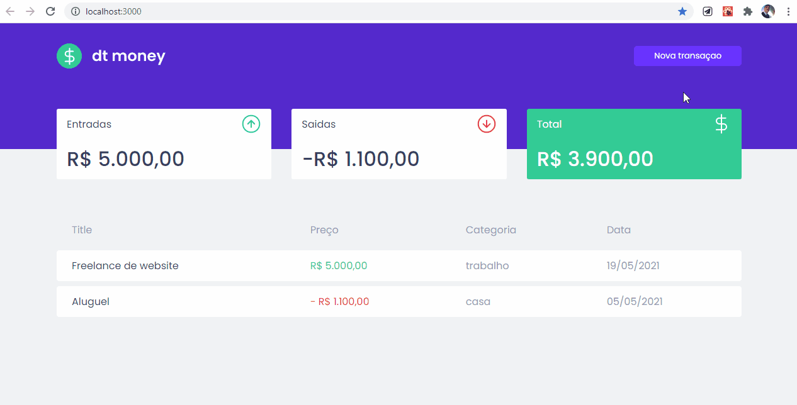

  </img>
  
 dt money

# Informaçoes:

## Aplicaçao dt money:

- Aplicaçao com finalidade de controle financeiro
- Gerencia gastos/ganhos

## Tecnologias:

### React:

- Utilizando a metodologia de contextos para compartilhar informaçoes em diferentes componentes.
- Hooks customizados para reaproveitar logica em diferentes paginas.
- Utilizando biblioteca react-modal para a funcionalidade de criaçao de trasações.

### styled-Components:

- Toda parte de estilo da aplicaçao vem dessa incrivel biblioteca de css-in-js.
- Metodologia de estilizações globais usando variaveis css e unidade de medida REM.
- Uso de funçoes javascript e variaveis apartir do repasse de propriedade.
- Integraçao com a biblioteca polished para executa suas funções de estilos.

### Typescript:

- Uso de tipagem estatica de variaveis para uma melhor experiencia e facilidade no desenvolvimento.

### Miragejs:

- Integraçao com essa Fake Api para realiza requisiçoes http sem back-end.
- Post e Get realizado apartir de sua funcionalidade de interceptaçao de rotas.

### Axios:

- Biblioteca usada nas requisições http.
- Escolhida por conta da sua funcionalidade de criar uma variavel baseURL e faciliade de manipular dados.

## Style:

<pre>
  variaveis css:
    --red: #f52f4d;
    --blue: #5429cc;
    --blue-light: #6933ff;
    --green: #33CC95;

    --text-title: #363f5f;
    --text-body: #969cb3;
    
    --background: #f0f2f5;
    --shape: #fff;
</pre>

## Links:

- <a href='https://github.com/facebook/react'>React</a>
- <a href='https://github.com/styled-components/styled-components'>Styled-Components</a>
- <a href='https://github.com/styled-components/polished'>Polished</a>
- <a href='https://www.typescriptlang.org/'>Typescript</a>
- <a href='https://miragejs.com/'>Miragejs</a>
- <a href='https://axios-http.com/docs/intro'>Axios</a>
- <a href='https://rocketseat.com.br/'>Rocketseat</a>

## Considerações:

<pre>
    Aplicaçao desenvolvida junto ao Bootcamp iginite da <a href='https://rocketseat.com.br/'>Rocketseat</a>.
</pre>
